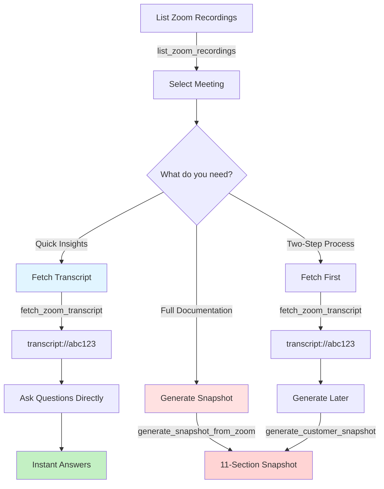

# MCP Snapshot Server

An MCP server that transforms Zoom meeting transcripts into instant AI-powered insights or comprehensive Customer Success Snapshots—giving you fast answers or detailed documentation, seamlessly integrated with Claude Desktop.

[]()
[]()
[]()

## Overview

MCP Snapshot Server is a production-ready Model Context Protocol (MCP) server that transforms Zoom meeting transcripts into actionable customer success intelligence. It provides two powerful modes of operation:

1. **Ad-Hoc Transcript Analysis** - Query Zoom transcripts directly for quick insights without generating full documentation
2. **Comprehensive Documentation** - Generate professional 11-section Customer Success Snapshots automatically

### What Makes This Unique

**🎯 Instant Transcript Access**
- Fetch Zoom transcripts and query them immediately in conversation
- Ask questions like "What pain points were discussed?" or "Who were the key stakeholders?"
- No need to generate full reports for simple questions—get answers in seconds

**📋 Full Documentation When Needed**
- Generate comprehensive 11-section snapshots for formal case studies
- Multi-agent AI system ensures accuracy and completeness
- Confidence scoring (0.0-1.0) for each section with quality validation
- Auto-validation catches inconsistencies across sections

**🔗 Seamless Zoom Integration**
- Direct OAuth 2.0 integration with Zoom's API
- List, search, and fetch transcripts without leaving your workflow
- Smart caching (15-min TTL) minimizes API calls and speeds up access
- Handles all authentication and error cases automatically

**🏗️ Enterprise-Grade Architecture**
- All 6 MCP primitives fully implemented (Tools, Resources, Prompts, Sampling, Elicitation, Logging)
- 111 passing tests with comprehensive error handling
- Hybrid NLP + AI approach: spaCy/NLTK for entity extraction, Claude for deep analysis
- Structured JSON logging with full traceability for debugging and auditing

### Why Users Choose This

**For Customer Success Managers:**
- Quickly review meeting transcripts to identify action items and concerns
- Generate professional case studies for marketing and sales enablement
- Track customer engagement patterns across multiple touchpoints

**For Sales Teams:**
- Extract key insights from discovery calls without manual note-taking
- Identify decision-makers, pain points, and buying signals automatically
- Create compelling customer stories backed by actual conversation data

**For Product Teams:**
- Analyze customer feedback patterns across many meetings
- Identify common feature requests and pain points at scale
- Generate data-driven insights from qualitative conversations

### Technical Highlights

✅ **Tools** - 4 specialized tools for Zoom integration and snapshot generation
✅ **Resources** - Transcripts, snapshots, sections, and field definitions exposed as MCP Resources
✅ **Prompts** - 11 section-specific prompts + field elicitation for completeness
✅ **Sampling** - Integrated Claude AI with retry logic and confidence scoring
✅ **Elicitation** - Interactive collection of missing field information
✅ **Logging** - Structured JSON logging with context and full traceability

## Table of Contents

- [Quick Start](#quick-start)
- [Usage Examples](#usage-examples)
- [Documentation](#documentation)
- [Architecture](#architecture)
- [Development](#development)
- [Contributing](#contributing)

## Quick Start

### Prerequisites

- **Python 3.10+** (3.11 or 3.12 recommended)
- **uv** package manager ([install](https://docs.astral.sh/uv/))
- **Anthropic API key** with Claude access
- **Zoom OAuth credentials** (Account ID, Client ID, Client Secret) - See [docs/ZOOM_SETUP.md](docs/ZOOM_SETUP.md)
  - ⚠️ **Important**: Your Zoom app must have the `cloud_recording:read:list_recording_files` scopes enabled

### Installation

```bash
# 1. Install uv (if not already installed)
curl -LsSf https://astral.sh/uv/install.sh | sh

# 2. Clone repository
git clone https://github.com/your-org/mcp-snapshot-server.git
cd mcp-snapshot-server

# 3. Install dependencies
uv sync --all-extras

# 4. Download NLP models
uv run python -m spacy download en_core_web_sm
uv run python -c "import nltk; nltk.download('punkt'); nltk.download('stopwords')"

# 5. Configure credentials
cp .env.example .env
# Edit .env and add:
#   - Your Anthropic API key (LLM_ANTHROPIC_API_KEY)
#   - Your Zoom credentials (ZOOM_ACCOUNT_ID, ZOOM_CLIENT_ID, ZOOM_CLIENT_SECRET)
#
# See docs/ZOOM_SETUP.md for detailed Zoom setup instructions
```

### Run Tests

```bash
# Run all tests (should see 107/108 passing)
uv run pytest tests/ -v

# Run specific test suites
uv run pytest tests/test_server.py -v      # MCP server tests
uv run pytest tests/test_agents/ -v        # Agent tests
```

## Usage Examples

### Basic Zoom Workflow

The server provides two workflow options depending on your needs:



**Mode 1: Fast Insights** (Left Path)
- Use when you need quick answers from a meeting
- Fetch transcript → Ask questions → Get instant insights
- Example: "What pain points were discussed?" "Who attended?"

**Mode 2: Comprehensive Documentation** (Right Paths)
- Use when you need formal case studies or detailed analysis
- Option A: One-step with `generate_snapshot_from_zoom`
- Option B: Two-step: fetch transcript, generate later
- Produces complete 11-section Customer Success Snapshot

### With Claude Desktop

1. **Find your uv installation path** (Claude Desktop needs the full path):
   ```bash
   which uv
   ```

2. **Add to Claude Desktop config** (`~/Library/Application Support/Claude/claude_desktop_config.json`):

```json
{
  "mcpServers": {
    "mcp-snapshot-server": {
      "command": "/Users/yourname/.local/bin/uv",
      "args": [
        "--directory",
        "/absolute/path/to/mcp-snapshot-server",
        "run",
        "mcp-snapshot-server"
      ],
      "env": {
        "LLM_ANTHROPIC_API_KEY": "${ANTHROPIC_API_KEY}",
        "ZOOM_ACCOUNT_ID": "${ZOOM_ACCOUNT_ID}",
        "ZOOM_CLIENT_ID": "${ZOOM_CLIENT_ID}",
        "ZOOM_CLIENT_SECRET": "${ZOOM_CLIENT_SECRET}"
      }
    }
  }
}
```

   **Important:** Replace `/Users/yourname/.local/bin/uv` with the output from step 1.

3. **Restart Claude Desktop**

4. **Use in conversation**:

```
# List my recent Zoom recordings with transcripts
list_zoom_recordings

# Search for specific recordings
list_zoom_recordings with topic containing "customer"

# Fetch and generate snapshot in one step
generate_snapshot_from_zoom for meeting ID 123456789

# OR: Fetch transcript to query it directly
fetch_zoom_transcript meeting_id="123456789"
# Returns: transcript://abc789

# Now ask questions about it
What pain points were discussed in transcript://abc789?
Who were the key attendees in that meeting?
```

See [CLAUDE_DESKTOP.md](CLAUDE_DESKTOP.md) for detailed integration guide.

### Programmatic Usage

```python
from mcp_snapshot_server.server import SnapshotMCPServer

# Initialize server
server = SnapshotMCPServer()

# List Zoom recordings
recordings = await server._call_tool(
    "list_zoom_recordings",
    {
        "from_date": "2024-11-01",
        "to_date": "2024-11-24",
        "search_query": "customer"
    }
)

# Fetch and cache specific transcript
transcript = await server._call_tool(
    "fetch_zoom_transcript",
    {"meeting_id": "123456789"}
)

# Generate snapshot from cached transcript
result = await server._call_tool(
    "generate_customer_snapshot",
    {
        "transcript_uri": "transcript://abc123",  # From fetch step
        "output_format": "json"  # or "markdown"
    }
)

# OR: One-step download + generate
result = await server._call_tool(
    "generate_snapshot_from_zoom",
    {
        "meeting_id": "123456789",
        "output_format": "markdown"
    }
)

# Access specific section via Resources
section = await server._read_resource(
    "snapshot://meeting/section/executive_summary"
)

# Get elicitation prompt for missing data via Prompts
prompt = await server._get_prompt(
    "elicit_missing_field",
    {
        "field_name": "roi_percentage",
        "section_name": "Financial Impact"
    }
)
```

### Command Line

```bash
# Run the MCP server
uv run mcp-snapshot-server

# Or use Python module
uv run python -m mcp_snapshot_server
```

## Documentation

### Essential Guides
- **[docs/ZOOM_SETUP.md](docs/ZOOM_SETUP.md)** - ⭐ Zoom OAuth setup (required for Zoom integration)
- **[CLAUDE_DESKTOP.md](CLAUDE_DESKTOP.md)** - Claude Desktop integration and configuration
- **[DEPLOYMENT.md](DEPLOYMENT.md)** - Production deployment guide
- **[SECURITY.md](SECURITY.md)** - Security best practices and considerations
- **[API_REFERENCE.md](API_REFERENCE.md)** - Complete API reference and examples

## Architecture

### Two Usage Modes

**Mode 1: Ad-Hoc Transcript Queries (Fast)**
```
Zoom Meeting ID
  ↓
fetch_zoom_transcript → Fetch & cache transcript
  ↓
transcript://abc789 (Exposed as MCP Resource)
  ↓
Query directly: "What were the pain points discussed?"
  ↓
Claude analyzes transcript text → Instant answer
```

**Mode 2: Full Snapshot Generation (Comprehensive)**
```
Zoom Meeting ID
  ↓
fetch_zoom_transcript OR generate_snapshot_from_zoom
  ↓
Cache Transcript (transcript://id)
  ↓
Parse Transcript → Extract structure, speakers, timing
  ↓
Analysis Agent → NLP entity extraction + topic identification
  ↓
11 Section Generator Agents → Specialized content for each section
  ↓
Validation Agent → Cross-section consistency + quality checks
  ↓
Executive Summary Generator → Synthesize final overview
  ↓
Complete 11-Section Snapshot with confidence scores
```

### Available Tools

1. **`list_zoom_recordings`** - List and search Zoom recordings with transcripts
2. **`fetch_zoom_transcript`** - Fetch & cache transcript (returns full text + URI)
3. **`generate_customer_snapshot`** - Generate full snapshot from cached transcript URI
4. **`generate_snapshot_from_zoom`** - One-step: fetch + generate full snapshot

### Transcript Querying (MCP Resources)

Fetched transcripts are exposed as MCP Resources with full text content, allowing immediate analysis:

```
# Fetch transcript (returns full content immediately)
fetch_zoom_transcript meeting_id="123456789"
→ Returns transcript://abc789 with full text

# Ask questions directly - no snapshot generation needed
"What pain points were discussed in this meeting?"
"Who were the key stakeholders mentioned?"
"Summarize the action items from this conversation"
"What technical requirements were identified?"
```

The transcript content is available both:
- **Immediately** in the tool response for instant access
- **As an MCP Resource** for structured programmatic access

### Multi-Agent System

```
OrchestrationAgent
├── AnalysisAgent (NLP + LLM hybrid analysis)
├── SectionGeneratorAgents × 11 (specialized per section)
└── ValidationAgent (consistency + quality checks)
```

### Technology Stack

- **Language**: Python 3.10+
- **Package Manager**: uv (10-100x faster than pip)
- **Linting**: ruff (Rust-based, replaces black + isort + flake8)
- **Type Checking**: mypy with strict mode
- **Testing**: pytest with 111 passing tests
- **LLM**: Anthropic Claude (Sonnet 4.5)
- **NLP**: spaCy + NLTK for entity extraction
- **API Integration**: Zoom OAuth 2.0 Server-to-Server
- **Protocol**: Model Context Protocol (MCP) - All 6 primitives
- **Validation**: Pydantic V2 for data validation and configuration

### The 11 Sections

1. **Customer Information** - Company details, contacts, industry
2. **Background** - Initial problems and challenges
3. **Solution** - Implemented products/services
4. **Engagement Details** - Timeline, milestones, team
5. **Results and Achievements** - Quantifiable improvements
6. **Adoption and Usage** - User engagement metrics
7. **Financial Impact** - ROI, cost savings, revenue
8. **Long-Term Impact** - Strategic benefits
9. **Visuals** - Suggested charts and graphics
10. **Additional Commentary** - Unique insights
11. **Executive Summary** - High-level overview

## Development

### Setup Development Environment

```bash
# Install dependencies with dev tools
uv sync --all-extras

# Install pre-commit hooks (optional)
pre-commit install
```

### Code Quality

```bash
# Format code
uv run ruff format .

# Lint and auto-fix
uv run ruff check --fix .

# Type check
uv run mypy src/

# Run all quality checks
uv run ruff format . && uv run ruff check --fix . && uv run mypy src/
```

### Testing

```bash
# Run all tests
uv run pytest tests/ -v

# Run with coverage
uv run pytest tests/ --cov=mcp_snapshot_server --cov-report=html

# Run specific test file
uv run pytest tests/test_server.py -v

# Run tests matching pattern
uv run pytest tests/ -k "test_snapshot" -v
```

### Project Structure

```
mcp-snapshot-server/
├── src/mcp_snapshot_server/
│   ├── server.py              # Main MCP server (all 6 primitives)
│   ├── __main__.py            # Entry point
│   ├── agents/                # Multi-agent system
│   │   ├── base.py           # Abstract base agent
│   │   ├── analyzer.py       # Transcript analysis
│   │   ├── section_generator.py  # Section generation
│   │   ├── validator.py      # Validation
│   │   └── orchestrator.py   # Workflow orchestration
│   ├── prompts/               # Templates and definitions
│   │   ├── system_prompts.py # Agent system prompts
│   │   ├── section_prompts.py# Section templates
│   │   └── field_definitions.py  # Elicitable fields
│   ├── tools/                 # VTT and NLP utilities
│   │   ├── transcript_utils.py
│   │   └── nlp_utils.py
│   └── utils/                 # Infrastructure
│       ├── config.py         # Pydantic settings
│       ├── logging_config.py # Structured logging
│       ├── errors.py         # Error handling
│       └── sampling.py       # LLM integration
├── tests/                     # 98 comprehensive tests
│   ├── test_server.py        # MCP server tests (27)
│   ├── test_agents/          # Agent tests (29)
│   ├── test_tools/           # Tool tests (17)
│   ├── test_utils/           # Utility tests (25)
│   └── fixtures/             # Test fixtures (VTT files)
├── docs/                      # Project documentation
│   ├── MCP_Server_Project_Specification.md
│   ├── All_Prompt_Details.txt
│   ├── System_Prompt_Customer_Success_Snapshot.txt
│   └── Quest_Enterprises_Kickoff_Transcript_Summary.md
├── .env.example              # Environment template
├── pyproject.toml            # Project config
└── README.md                 # This file
```

## Configuration

### Environment Variables

```bash
# Required
LLM_ANTHROPIC_API_KEY=sk-ant-your-key-here

# Optional - LLM Settings
LLM_MODEL=claude-3-5-sonnet-20241022
LLM_TEMPERATURE=0.3
LLM_MAX_TOKENS=4000

# Optional - Workflow
WORKFLOW_PARALLEL_SECTION_GENERATION=false
WORKFLOW_MIN_CONFIDENCE_THRESHOLD=0.5

# Optional - NLP
NLP_SPACY_MODEL=en_core_web_sm
NLP_MAX_ENTITIES_PER_TYPE=10

# Optional - Logging
LOG_LEVEL=INFO
```

See `.env.example` for all configuration options.

## Production Deployment

For production deployment:
1. Review [DEPLOYMENT.md](DEPLOYMENT.md) for deployment options
2. Review [SECURITY.md](SECURITY.md) for security best practices
3. Set up monitoring and logging
4. Configure rate limiting
5. Implement backup strategy

### Quick Production Setup

```bash
# Using systemd (Linux)
sudo cp deploy/mcp-snapshot-server.service /etc/systemd/system/
sudo systemctl enable mcp-snapshot-server
sudo systemctl start mcp-snapshot-server

# Using Docker
docker build -t mcp-snapshot-server .
docker run -e LLM_ANTHROPIC_API_KEY=your-key mcp-snapshot-server
```

## Contributing

Contributions welcome! Please:

1. Fork the repository
2. Create a feature branch (`git checkout -b feature/amazing-feature`)
3. Make your changes
4. Run tests (`uv run pytest tests/ -v`)
5. Run code quality checks (`uv run ruff format . && uv run ruff check --fix .`)
6. Commit your changes (`git commit -m 'Add amazing feature'`)
7. Push to the branch (`git push origin feature/amazing-feature`)
8. Open a Pull Request

### Development Guidelines

- Write tests for new features
- Maintain test coverage above 80%
- Follow existing code style (ruff enforces this)
- Update documentation for user-facing changes
- Add type hints (mypy enforces this)

## Troubleshooting

### Claude Desktop: "spawn uv ENOENT" Error

This is the most common installation issue. Claude Desktop cannot find the `uv` command.

**Solution:** Use the full path to `uv` in your config:
```bash
# 1. Find uv path
which uv

# 2. Update claude_desktop_config.json with the full path:
# "command": "/Users/yourname/.local/bin/uv"  ← Use your actual path
```

See [CLAUDE_DESKTOP.md](CLAUDE_DESKTOP.md#troubleshooting) for detailed troubleshooting.

### Server Won't Start

```bash
# Check Python version
python --version  # Should be 3.10+

# Verify dependencies
uv sync

# Check API key
echo $LLM_ANTHROPIC_API_KEY

# View logs
journalctl -u mcp-snapshot-server -f
```

### API Errors

- Verify API key is valid
- Check Anthropic API status
- Review rate limits
- Check network connectivity

### Poor Quality Snapshots

- Ensure transcript has clear speaker labels
- Check transcript quality (clear, complete content)
- Adjust `LLM_TEMPERATURE` (lower = more conservative)
- Review section prompts for customization

### Tests Failing

```bash
# Clean and reinstall
rm -rf .venv
uv sync --all-extras

# Download models again
uv run python -m spacy download en_core_web_sm

# Run tests
uv run pytest tests/ -v
```

## License

MIT License - see [LICENSE](LICENSE) file for details.

## Support

- **Documentation**: Check docs in this repository
- **Issues**: Open a [GitHub Issue](https://github.com/your-org/mcp-snapshot-server/issues)
- **Security**: See [SECURITY.md](SECURITY.md) for reporting vulnerabilities

## Changelog

### v1.0.0 (Current)
- ✅ All 6 MCP primitives implemented
- ✅ 11-section snapshot generation
- ✅ Multi-agent orchestration
- ✅ Claude Desktop integration
- ✅ 98/98 tests passing
- ✅ Production-ready documentation

---

**Built with ❤️ using Claude AI**
